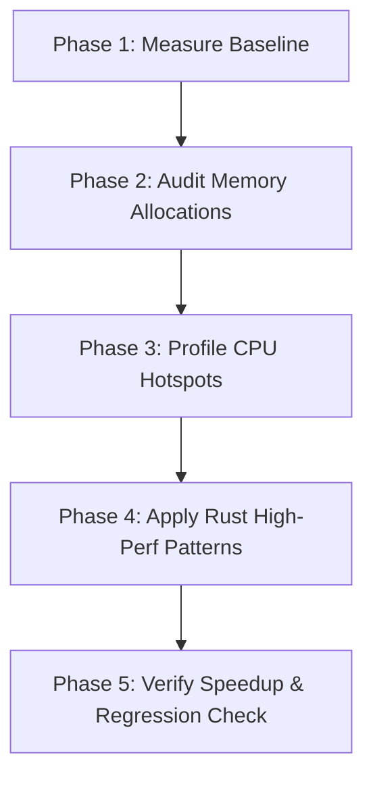

# Field CAD Performance Profiling & Optimization Workflow

**Target Audience:** Developers and AI Agents (Antigravity, Claude Code, Subagents)  
**Location:** `docs/perf/performance-workflow.md`  
**Status:** Active Workflow Guide  

---

## Overview

This guide establishes the standard, reproducible performance investigation, benchmarking, and allocation profiling workflow for `Field CAD`. 

The goal of this workflow is to systematically catch performance regressions, eliminate per-tick allocations on simulation hot paths, and verify algorithmic scaling before committing changes to the codebase.

---

## Toolkit Matrix

| Tool | Focus Area | Primary Output | Recommended Command |
| :--- | :--- | :--- | :--- |
| **`fieldcad-bench`** | Domain-specific compute scaling & regression verification | JSON baselines, complexity checks ($O(N)$), per-unit timing | `cargo run --release -p fieldcad-bench` |
| **`hyperfine`** | CLI execution, end-to-end wall-clock timing comparisons | Statistical summaries (mean, stddev), side-by-side speedup | `hyperfine --warmup 3 'cmd1' 'cmd2'` |
| **`dhat`** | Heap allocation profiling, short-lived churn, peak memory | `dhat-heap.json` (viewable via DHat Web Viewer) | Custom `#[global_allocator]` harness run |
| **`cargo-flamegraph`** | On-CPU time distribution & call-stack flamegraphs | `flamegraph.svg` | `cargo flamegraph --release -p fieldcad-bench` |
| **`samply`** | Interactive execution timeline profiling (Firefox Profiler) | Local web profile session | `samply record cargo run --release` |

---

## Step-by-Step Performance Workflow



---

### Phase 1: Macro Benchmarking & Baseline Generation

Before touching any code in hot paths (e.g., Yee leapfrog step, particle coupling, probe sampling):

1. **Build exclusively in `--release` mode:**
   Always use release builds. Debug-profile `f64` compute metrics are unrepresentative.

2. **Establish a pre-change baseline with `fieldcad-bench`:**
   ```bash
   cargo run --release -p fieldcad-bench -- --save-baseline baseline-pre.json
   ```

3. **Isolate specific workloads during iteration:**
   ```bash
   cargo run --release -p fieldcad-bench -- --filter maxwell/step --quick
   ```

4. **Compare CLI binary performance using `hyperfine`:**
   ```bash
   # Benchmark quick workload runs or headless session commands
   hyperfine --warmup 3 \
     --export-markdown docs/perf/artifacts/hyperfine-comparison.md \
     './target/release/fieldcad-bench --filter maxwell/step'
   ```

---

### Phase 2: Memory & Allocation Profiling (`dhat`)

Per-tick allocations in simulation loops (e.g., allocating `Vec<DVec3>` or cloning Yee field grids every tick) severely degrade cache performance and trigger allocator locks.

1. **Instrument the test binary or bench runner:**
   Temporarily enable `dhat` in `crates/fieldcad-bench` or the target integration test:
   ```rust
   #[cfg(feature = "dhat-heap")]
   #[global_allocator]
   static ALLOC: dhat::Alloc = dhat::Alloc;

   fn main() {
       #[cfg(feature = "dhat-heap")]
       let _profiler = dhat::Profiler::builder().build();

       // Execute hot simulation workload...
   }
   ```

2. **Run the workload:**
   ```bash
   cargo run --release -p fieldcad-bench --features dhat-heap -- --filter maxwell/step
   ```

3. **Analyze the report:**
   * Open the generated `dhat-heap.json` in **[https://nnethercote.github.io/dh_view/dh_view.html](https://nnethercote.github.io/dh_view/dh_view.html)**.
   * **Filter by Short-Lived Allocations:** Identify temporary allocations created and destroyed inside loop iterations.
   * **Filter by At-Peak Allocations:** Detect unexpected full-grid or scene clones (candidates for `Cow<'a, [T]>` or `Arc<[T]>`).

---

### Phase 3: CPU Sampling & Hotspot Analysis (`cargo-flamegraph` / `samply`)

1. **Ensure Debug Symbols are Enabled in Release Profile:**
   Verify `Cargo.toml` preserves debug symbols for accurate symbolication:
   ```toml
   [profile.release]
   debug = true
   ```

2. **Generate a CPU Flamegraph:**
   ```bash
   # Install tool if missing
   cargo install flamegraph

   # Profile specific benchmark workload
   cargo flamegraph --release -p fieldcad-bench --output docs/perf/artifacts/flamegraph-maxwell.svg -- --filter maxwell/step
   ```

3. **Inspect Stack Frames:**
   * Open `flamegraph.svg` in a browser.
   * Look for wide horizontal boxes indicating functions occupying significant execution time.
   * Check for unexpected `std::fmt`, string allocation, hash map lookup, or `dyn Trait` vtable dispatch overhead in inner loops.

4. **Detailed Timeline Profiling with `samply` (Optional):**
   ```bash
   samply record cargo run --release -p fieldcad-bench -- --filter maxwell/step
   ```

---

### Phase 4: Optimization Rules for Field CAD

When refactoring identified bottlenecks, enforce these project conventions:

1. **Zero-Allocation Hot Paths:**
   * Pass reusable output buffers (`&mut Vec<T>` or `&mut [T]`) down to solvers rather than returning newly allocated collections.
   * Use `SampleCache` in plugins to reuse allocations across ticks and channels.
   * Store shared immutable buffers as `Arc<[T]>`.

2. **High-Locality Data Structures:**
   * Use Struct of Arrays (SoA) layout for high-count particle arrays to encourage LLVM SIMD auto-vectorization.
   * Prefer primitive integer handles (`ChannelHandle(u16)`) over `String` key lookups in sampling paths.

3. **Precision & Units:**
   * Authoritative simulation must remain in SI `f64`. Do not degrade precision to `f32` unless operating explicitly on GPU metadata boundaries.

---

### Phase 5: Verification & Evidence Gathering

Before submitting changes or closing a task:

1. **Validate Non-Regression via `fieldcad-bench`:**
   ```bash
   cargo run --release -p fieldcad-bench -- --baseline baseline-pre.json --fail-on-regression
   ```
   * **Verification Criteria:**
     * Exits with `0`.
     * Measured growth complexity remains within declared complexity (e.g., $O(N)$ in cells/particles).
     * Execution time does not regress by >10% relative to `baseline-pre.json`.

2. **Run Automated Test Suite:**
   ```bash
   cargo test --workspace
   ```

3. **Document Findings in `docs/perf/`:**
   Create a markdown report following the established naming scheme (e.g., `docs/perf/YYYY-MM-DD-<topic>-audit.md`) summarizing:
   * **Baseline vs. Optimized Timings** (from `fieldcad-bench` or `hyperfine`).
   * **Allocation Reduction Summary** (from `dhat`).
   * **Root Cause & Solution Summary** (referencing modified crates and lines of code).
